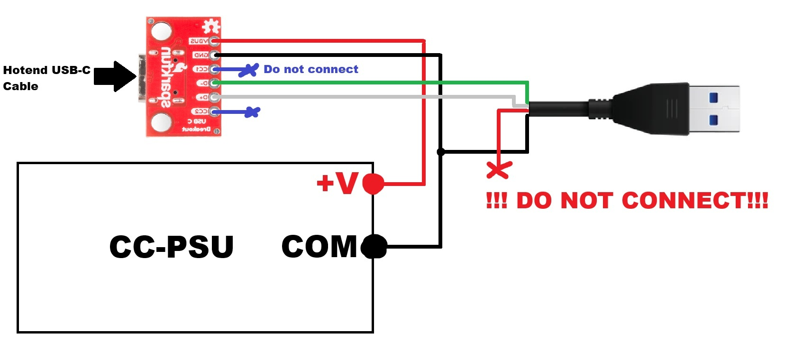

# Connect hotend to Raspberry

The hotend is shipped with Klipper V9 (EU Batch 1 machine) pre-installed but is connected to the CC-mainboard with a customized USB-C.

# Physical Connection

The hotend uses USB-C at 24v but does **NOT** negotiates with standard USB protocol, thus **CAN NOT** be connected to other devices, and the CC-Mainboard's USB-C under **NO CIRCUMSTANCES** must be connected to any USB-C device. It's constant 24v and will instantly fry the client device.

### Requirements

- Random USB 2.0 A-type cable
- USB-C breakout board (either 4 or 6 pin, doesn't matter)

### Adapter Wiring



**NOTE**
Some USB cable doesn't have the negative (black) wire coated, and instead it's a free wire. If there are two free wires (silver + copper) one is the shielding, the negative can be found with a multimeter. On the above image the greay line represents the white cable, not the naked silver.

**NOTE**
Some cheap chinese USB cable were spotted with white/green wires mixed up. If possible, confirm the cable colors with a multimeter. "Google USB Cable Colors" and "USB-A pins".

## Klipper Connection

The hotend -still- won't connect properly on some Klipper install, as it's an ACM device. If you installe Klipper with the Pi-Imager tool, chances are you don't have the `cdc-acm` kernel module loaded. Doing it manually would require constantly SSH-ing in and running the command. To make the Linux automatically load it, we need to edit the `/etc/modules` file to include a new line `cdc-acm`, then reboot the Raspberry.

### Klipper [mcu] Config

```yaml
[mcu]
serial: /dev/ttyACM1
baud: 1000000
restart_method: command
```

To figure out your ttyACM device, SSH into the Raspberry and go to `/dev`. Run the command `ls` to list all files, and locate any file that's named `ttyACM` with a number at the end.

## Outdated MCU error

Most likely you'll get an outdated MCU error with the MCU being V9, and your Klipper being up-to-date. Flashing the newest Klipper onto the hotend boards requires extra hardware and some soldering thin legs of the controller and it would break compatiblity with the factory mainboard.

## ttyACMx constantly changing

TODO: Find solution