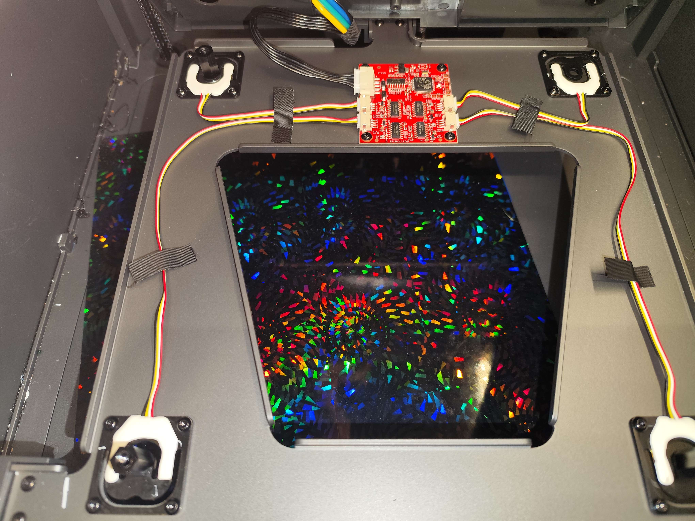
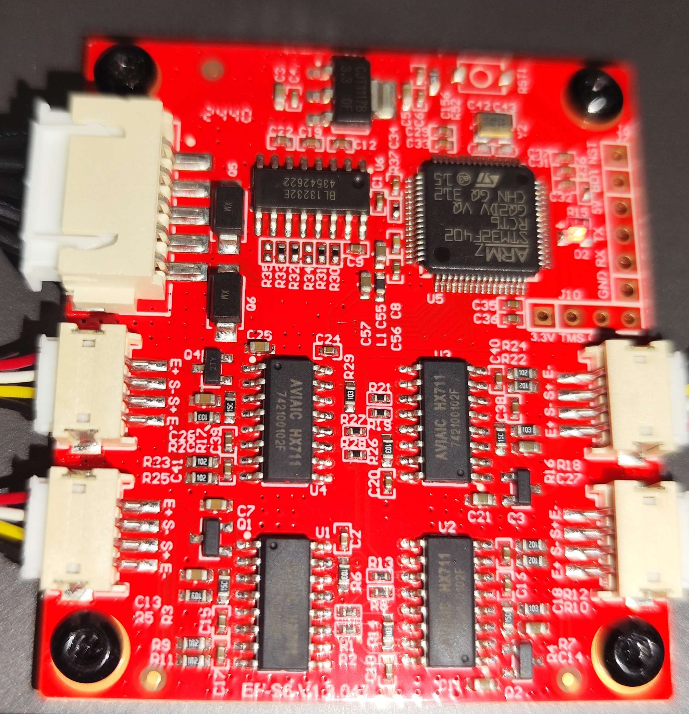
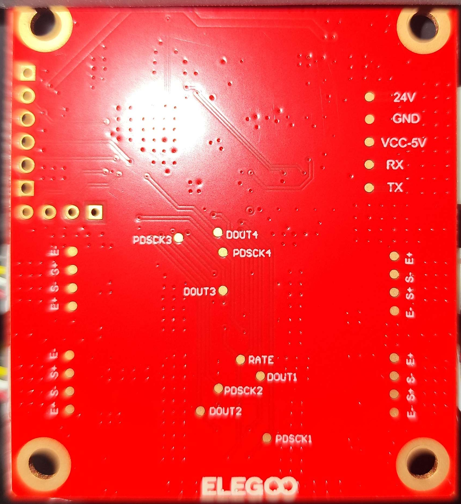

Metric|Value
---|---
MCU|STM32F402RCT6
Vendor Id|1d50
Product Id|614e
Device BCD|2.00
Product|STM32 Virtual ComPort
Manufacturer|ShenZhenCBD

{ width="600" }
/// caption
Credit to rabirx on the OpenCentauri Discord.
///

Front|Back
---|---
{ width="800" }|{ width="800" }
Credit to rabirx on the OpenCentauri Discord.|Credit to rabirx on the OpenCentauri Discord.

The bed is its own Klipper MCU with an accelerometer and some pressure sensors. The heating is not controlled by the MCU, but via a seperate AC board.

The board connects with serial (not over USB) to the mainboard.

## Pressure Sensor System

The bed uses an innovative pressure-based auto-leveling system with 4 HX711 load cell amplifiers.

### HX711 Configuration

The bed MCU manages 4 HX711 sensors with advanced signal processing:

| Feature | Details |
|---------|---------|
| Sensor Count | 4 HX711 modules |
| Filter Type | Kalman filter |
| Communication | Via bed MCU (STM32F402RCT6) |
| Protocol | Modified Klipper with filter parameters |

### Klipper Protocol Extensions

The strain gauge system uses extended Klipper commands:

```
config_hx711s oid=%c hx711_count=%c channels=%u rest_ticks=%u
              kalman_q=%u kalman_r=%u max_th=%u min_th=%u k=%u
query_hx711s oid=%c times_read=%hu
```

#### Kalman Filter Parameters

- `kalman_q` - Process noise covariance
- `kalman_r` - Measurement noise covariance
- `max_th` - Maximum threshold
- `min_th` - Minimum threshold
- `k` - Gain factor

### Calibration Commands

Extended calibration protocol:

```
config_hx711_sample oid=%c hx711_count=%c kalman_q=%u kalman_r=%u
add_hx711_sample oid=%c index=%c clk_pin=%u sdo_pin=%u
calibration_sample oid=%c times_read=%hu
```

G-code calibration:
```gcode
CALIBRATION_HX711_SAMPLE  # Run HX711 calibration routine
```

### Strain Gauge Configuration

From `unmodifiable.cfg`:

```ini
[strain_gauge]
# Force update at startup if update=0
update : 1
# Fixed Z-offset compensation values
standard_fix_z_offset : 0.15
enhancement_fix_z_offset : 0.17
```

### Homing Modes

The firmware mentions two homing systems:

1. **Photoelectric homing** - Optical sensor (details unknown)
2. **Strain gauge homing** - Using the 4 pressure sensors

During Z-homing:
```
Photoelectric home....
strain gauge home....
```

### Signal Processing

The HX711 data goes through multiple processing stages:

1. **Raw ADC reading** from HX711
2. **Kalman filtering** for noise reduction
3. **Threshold detection** for trigger events
4. **Temperature compensation** (if enabled)

### Trigger Detection

Strain gauge trigger format:
```
strain gauge TRIGGER: %02x trigger_index:%d at:%f
```

Where:
- `%02x` - Trigger status byte
- `trigger_index` - Which sensor triggered (0-3)
- `at:%f` - Timestamp of trigger

### Testing Functions

The firmware includes test functions for the HX711 system:

```c
kbuf_test_use_cur_buf(0x%lx)  // Test current buffer
kbuf_test_use_new_buf()        // Test new buffer
```
