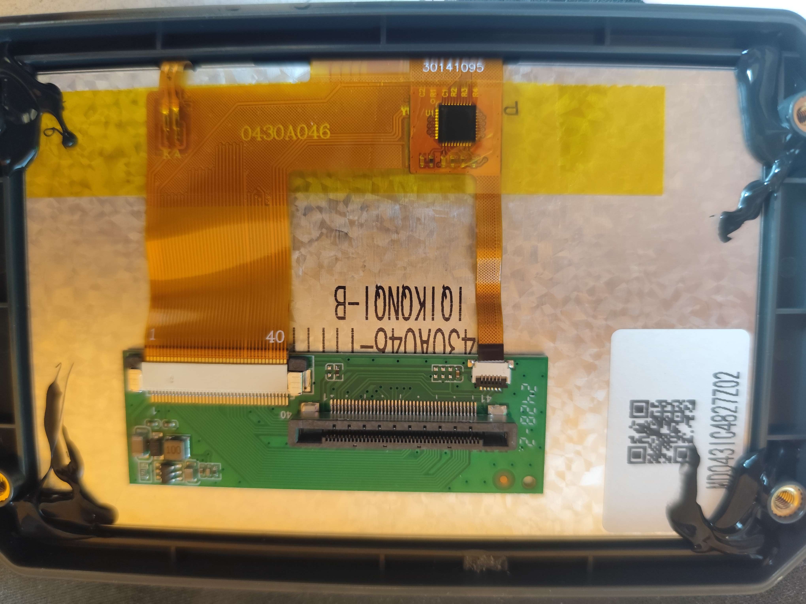

{ width="600" }
/// caption
Credit to rabirx on the OpenCentauri Discord.
///

The screen is a generic `0430A046-I1I1100` LCD screen (capacitive touch screen version). The driver board is custom, probably just re-routes the screen wires to the mainboard that implements the actual driver.

## Display Debug Interface

The screen backlight and display can be controlled through an undocumented kernel debug interface.

### Backlight Control

The AllWinner SoC exposes display control via debugfs:

```bash
# Set backlight brightness (0-255)
echo setbl > /sys/kernel/debug/dispdbg/command
echo lcd0 > /sys/kernel/debug/dispdbg/name
echo 191 > /sys/kernel/debug/dispdbg/param
echo 1 > /sys/kernel/debug/dispdbg/start
```

Common brightness values:
- `0` - Display off
- `64` - 25% brightness
- `128` - 50% brightness
- `191` - 75% brightness (default at startup)
- `255` - Maximum brightness

### Interface Structure

| File | Purpose |
|------|---------|
| `/command` | Command to execute (setbl, enable, disable, blank) |
| `/name` | Target display name (lcd0) |
| `/param` | Command parameter (0-255 for brightness) |
| `/start` | Trigger execution (write 1) |

### Programmatic Control

Example Python script for brightness control:

```python
def set_backlight(brightness):
    """Set display backlight (0-255)"""
    with open('/sys/kernel/debug/dispdbg/command', 'w') as f:
        f.write('setbl')
    with open('/sys/kernel/debug/dispdbg/name', 'w') as f:
        f.write('lcd0')
    with open('/sys/kernel/debug/dispdbg/param', 'w') as f:
        f.write(str(brightness))
    with open('/sys/kernel/debug/dispdbg/start', 'w') as f:
        f.write('1')

# Examples
set_backlight(0)    # Turn off
set_backlight(128)  # 50% brightness
set_backlight(255)  # Maximum brightness
```

### Power Saving Mode

The display can be turned off programmatically for power saving:

```bash
# Turn off display
echo 0 > /sys/kernel/debug/dispdbg/param

# Turn on display (restore to 75%)
echo 191 > /sys/kernel/debug/dispdbg/param
```