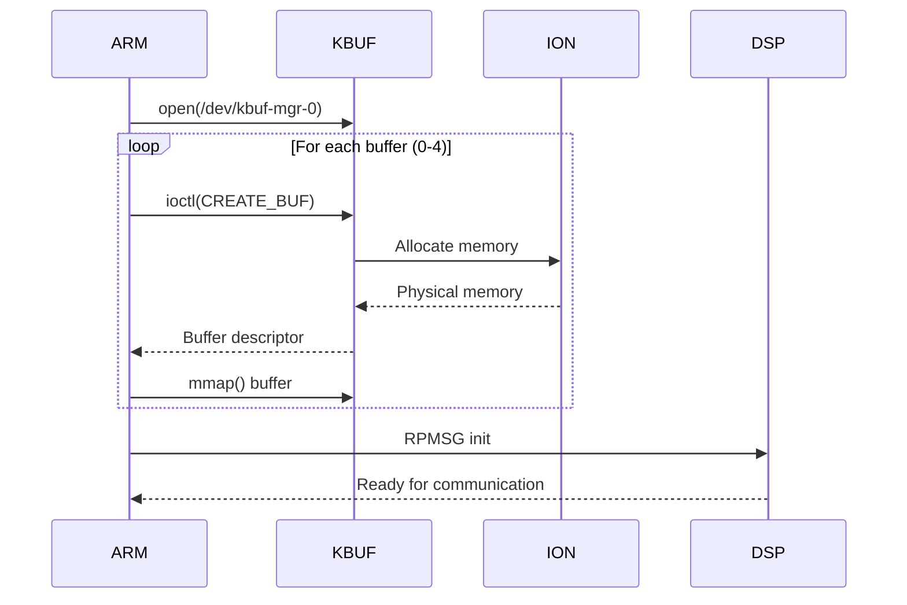

# DSP Communication Interface

The Centauri Carbon main MCU uses an DSP (Digital Signal Processor) shared memory interface instead of traditional serial communication.

## Overview

The DSP communication system uses ION memory allocator to create shared memory buffers between the ARM CPU and DSP, enabling high-speed, deterministic communication.

## Architecture

### Memory Layout

```
┌─────────────────┐        DSP Remote Processor        ┌─────────────┐
│   ARM (app)     │ ──────── dsp_rproc@0 ──────────►   │     DSP     │
│                 │                                    │             │
│ DSP_mem_Init()  │        Shared Memory               │ Memory      │
│       ↓         │ ◄──── /dev/kbuf-mgr-0 ────────►    │Communication│
│ init_dsp_kbuf:  │                                    │             │
│   0,1,2,3,4     │    /dev/kbuf-map-0-strain_0        │             │
│                 │    /dev/kbuf-map-1-strain_1        │             │
│                 │    /dev/kbuf-map-2-strain_2        │             │
│                 │    /dev/kbuf-map-3-strain_3        │             │
│                 │    /dev/kbuf-map-4-strain_4        │             │
└─────────────────┘                                    └─────────────┘
                              ↓
                    /dev/dsp_debug (debug interface)
```

### Key Components

1. **Buffer Manager**: `/dev/kbuf-mgr-0`
2. **Memory Allocator**: ION via `/dev/ion`
3. **Transport Layer**: RPMSG with `msgbox_demo` endpoint
4. **Debug Interface**: `/dev/dsp_debug`

## kbuf Buffer Structure

```c
struct kbuf {
    char  *name;    // Buffer name (e.g., "strain_0")
    u32   len;      // Buffer size
    u32   type;     // Buffer type
    int   minor;    // Minor device number
    ulong va;       // Virtual address
    ulong pa;       // Physical address
};
```

## Initialization Sequence

The DSP interface initializes in a specific sequence:



## IOCTL Commands

| Command | Description | Parameters |
|---------|-------------|------------|
| `CREATE_BUF` | Create shared buffer | Buffer size, type |
| `DESTROY_BUF` | Destroy buffer | Buffer ID |
| `ION_IOC_SUNXI_FLUSH_RANGE` | Sync memory cache | Address range |

## kbuf API Functions

### Buffer Management

```c
kbuf_get_buffer()     // Acquire buffer for use
kbuf_put_buffer()     // Release buffer
kbuf_use_cur_buf()    // Use current buffer
kbuf_use_new_buf()    // Switch to new buffer
kbuf_free_buffer()    // Free buffer memory
```

### Testing Functions

```c
kbuf_test_use_cur_buf(0x%lx)  // Test current buffer
kbuf_test_use_new_buf()        // Test new buffer
```

!!! tip "Testing Support"
    The presence of test functions suggests the interface can be validated without full hardware implementation.

## Klipper Protocol Transport

The standard Klipper protocol is transported through shared memory:

### Message Format

```c
// Read operation
<%s:%d>read  %lx from paddr:%lx(user vaddr:%lx, kernel vaddr:%lx)

// Write operation
<%s:%d>write %lx to paddr:%lx(user vaddr:%lx, kernel vaddr:%lx)

// Example
<strain_0>read 0x1234 from paddr:0x40000000(user vaddr:0xb6f00000, kernel vaddr:0xc0000000)
```

### Protocol Flow

1. **Command Phase**: ARM writes Klipper command to shared buffer
2. **Notification**: RPMSG signals DSP
3. **Processing**: DSP processes command
4. **Response**: DSP writes response to buffer
5. **Completion**: ARM reads response

## Debugging

### Enable Debug Output

```bash
# Monitor DSP communication
cat /dev/dsp_debug

# Check buffer allocation
dmesg | grep -E "kbuf|ION"

# View DSP state
cat /sys/class/remoteproc/remoteproc0/state
```
