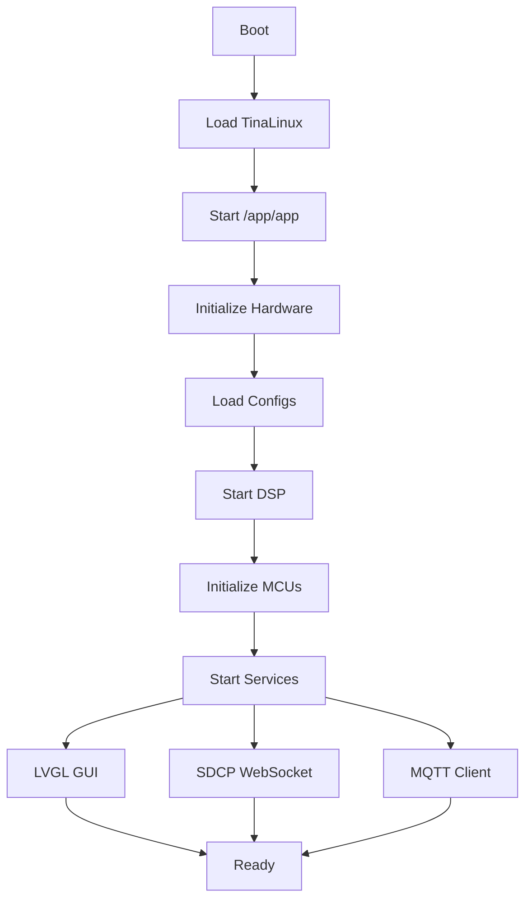

# Firmware Internals

The Centauri Carbon runs a heavily modified version of Klipper that has been transpiled from Python to C++ and integrated with proprietary components.

## Architecture Overview

### Binary Details

| Property | Value |
|----------|-------|
| Binary Path | `/app/app` |
| Architecture | ARM 32-bit LSB ELF |
| Size | ~3.4MB |
| Base System | TinaLinux/OpenWrt |
| Klipper Version | 0.9.1 (modified) |

### Software Stack

```
┌───────────────────────────────────────────────────────┐
│                    /app/app (3.4MB)                   │
│  ┌─────────────┬──────────────┬────────────────────┐  │
│  │   Klipper   │     SDCP     │       EIOT         │  │
│  │   (C++)     │   WebSocket  │   MQTT/Agora       │  │
│  └─────────────┴──────────────┴────────────────────┘  │
│             │              │               │          │
│  ┌──────────┴──────────────┴───────────────┴────────┐ │
│  │                  Core System                     │ │
│  │  ┌────────────┬─────────────┬─────────────────┐  │ │
│  │  │ DSP MemOps │ Serial Mgr  │   Config Parser │  │ │
│  │  │ (kbuf/ION) │ (ttyS4/ACM) │  (.cfg files)   │  │ │
│  │  └────────────┴─────────────┴─────────────────┘  │ │
│  └──────────────────────────────────────────────────┘ │
└────────────────────────┬──────────────────────────────┘
                         │
                    Hardware Layer
```

## Source Code Structure

The firmware is built from a Jenkins CI/CD pipeline with the following structure:

```
PPL_104-PACKAGE-FIRMWARE/
├── main.cpp                      # Main entry point
├── core/
│   ├── klippy/                   # Transpiled Klipper (Python→C++)
│   │   ├── klippy.cpp           # Core Klipper engine
│   │   ├── mcu.cpp              # MCU communication
│   │   ├── clocksync.cpp        # Clock synchronization
│   │   ├── serialhdl.cpp        # Serial port management
│   │   ├── chelper/             # Original C helpers
│   │   │   ├── serialqueue.c    # Optimized serial queue
│   │   │   └── stepcompress.c   # Step compression algorithm
│   │   ├── extras/              # Additional modules
│   │   │   ├── strain_gauge.cpp # Pressure sensor management
│   │   │   ├── hx711s.cpp       # HX711 driver with Kalman filter
│   │   │   ├── break_save.cpp   # Power loss recovery
│   │   │   └── change_filament.cpp # Auto filament change
│   │   └── kinematics/          # Motion control
│   │       ├── corexy.cpp       # CoreXY kinematics
│   │       └── extruder.cpp     # Extruder control
│   ├── allwinner/
│   │   └── dspMemOps.c          # DSP memory operations
│   ├── aw/
│   │   └── uart_combus.c        # AllWinner UART extensions
│   ├── NumCpp/                  # Numerical computing library
│   └── boost/                   # C++ Boost framework
├── app/e100/                    # Main application
│   ├── app.cpp                  # Application logic
│   ├── app_main.cpp             # Application entry
│   ├── app_print.cpp            # Print job management
│   ├── app_msgbox.cpp           # IPC messaging
│   └── app_calibration.cpp      # Calibration routines
├── EIOT/                        # IoT Integration
│   ├── EMQTT.cpp               # MQTT client
│   ├── Agora_RTC.cpp           # Video streaming
│   └── EIOT.cpp                # IoT manager
├── sdcp/                        # Web API
│   ├── sdcp_v3.cpp             # SDCP v3.0.0 protocol
│   └── sdcp_v3_handler.cpp     # API handlers
├── devices/                     # Hardware drivers
│   ├── serial.c                # Serial ports
│   └── ota.c                   # OTA updates
└── gui/lvgl/                    # Touch UI (LVGL)
```

## Transpilation System

### Python to C++ Conversion

The original Klipper Python code has been converted to C++ using:

- **Boost.Python** - For Python-like constructs in C++
- **NumCpp** - NumPy equivalent for numerical operations

!!! info "Transpilation Example"
    ```python
    # Original Python
    def get_position(self):
        return self._position
    ```
    ```cpp
    // Transpiled C++
    std::vector<double> MCU_stepper::get_position() {
        return this->m_position;
    }
    ```

### Dependencies

| Library | Version | Purpose |
|---------|---------|---------|
| FFmpeg | 58 | Video encoding |
| x264 | 157 | H.264 compression |
| Agora RTC | - | Cloud streaming |
| Boost | - | C++ utilities |
| NumCpp | - | Numerical computing |
| LVGL | - | GUI framework |

## Key Modules

### Strain Gauge System

Manages the bed's pressure sensors:

```cpp
// strain_gauge.cpp
class StrainGauge {
    void config_hx711s(uint8_t oid, uint8_t count,
                      uint32_t kalman_q, uint32_t kalman_r);
    void query_hx711s(uint8_t oid, uint16_t times_read);
};
```

### Break Save (Power Loss Recovery)

Automatically saves print state:

```cpp
// break_save.cpp
class BreakSave {
    std::string save_file = "/board-resource/break_save0.gcode";
    void save_state();
    void restore_state();
};
```

### IoT Integration

Cloud connectivity features:

```cpp
// EIOT/EMQTT.cpp
class EMQTT {
    void connect(const std::string& server);
    void publish(const std::string& topic, const json& data);
    void subscribe(const std::string& topic);
};
```

Servers:
- China: `mqtt://device.elegoo.com.cn`
- Europe: `mqtt://eu-device.elegoo.com`

## Configuration System

### File Structure

```
/board-resource/
├── printer.cfg          # Main Klipper config
├── user_printer.cfg     # User overrides
├── unmodifiable.cfg     # Locked parameters
├── sysconf.cfg          # System settings
├── break_save0.gcode    # Power loss recovery
├── lastlog              # Debug log
├── history.txt          # Print history
└── history_image/       # Print thumbnails
```

### Configuration Priority

1. `unmodifiable.cfg` - Highest (cannot be changed)
2. `user_printer.cfg` - User customizations
3. `printer.cfg` - Default configuration
4. `sysconf.cfg` - System parameters

## Startup Sequence



### Display Initialization

During startup, the display backlight is set:

```bash
echo setbl > /sys/kernel/debug/dispdbg/command
echo lcd0 > /sys/kernel/debug/dispdbg/name
echo 191 > /sys/kernel/debug/dispdbg/param
echo 1 > /sys/kernel/debug/dispdbg/start
```

## Debug Features

### Crash Reporting

Full ARM register dumps on MCU crash:

```
extruder_bootup_info oid=%c crash_flag=%c rest_cause=%c
                     R0=%u R1=%u R2=%u R3=%u R12=%u
                     LR=%u PC=%u xPSR=%u
```

### Log Files

- `/board-resource/lastlog` - Last session log
- `/user-resource/coredump-*.gz` - Core dumps
- `/var/log/messages` - System logs

### Debug Interfaces

- `/dev/dsp_debug` - DSP communication
- `/sys/kernel/debug/dispdbg/` - Display control
- Serial console on UART pins

## Security Features

### Authentication

- Device RTM ID for cloud services
- Pincode system for app pairing
- Signed OTA updates
